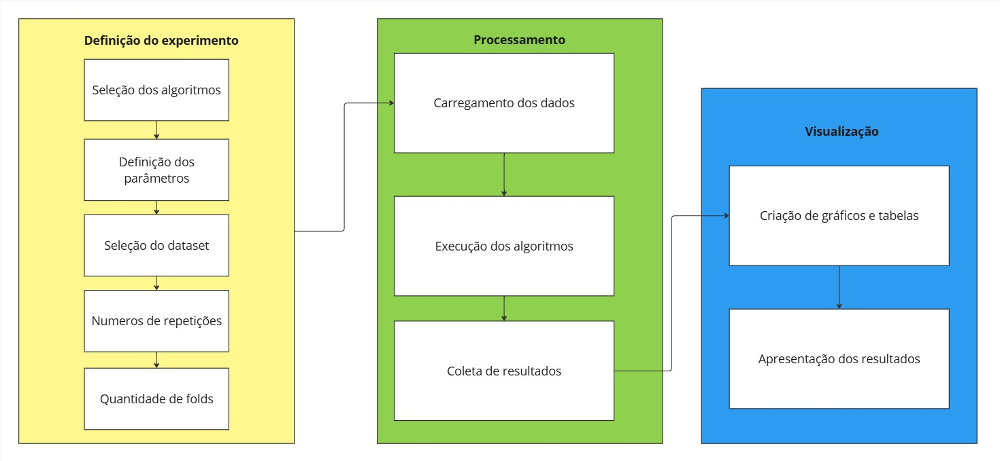

# MLBenchX
MLBenchX é um benchmark para análise de desempenho de algoritmos de classificação multiclasse em aprendizado de máquina. Combina flexibilidade ao incluir dinamicamente diferentes tipos de classificadores e conjuntos de dados, além de especificar número de repetições e parâmetros dos algoritmos. Com ele é possível comparar desde algoritmos simples como um DummyClassifier até um algoritmo mais robusto como o XGBoost.

## Arquitetura do benchmark

## Detalhes de código do benchmark
O código foi desenvolvido em python utilizando as bibliotecas pandas, numpy, scikit-learn, matplotlib, seaborn, json, joblib, argparse e xgboost. Utilizou-se de técnicas de aprendizado de máquina como encoder para transformar os rótulos dos dados em categorias numéricas sequenciais e validação cruzada com técnica de divisão dos dados stratified k-fold. Para cada run (repetição), os algoritmos são inicializados novamente com os parâmetros fornecidos, e então treinados a partir da validação cruzada que divide os dados em algumas partes, treina o modelo e coleta os resultados conforme as métricas fornecidas.
Em posse dos resultados para cada validação cruzada, calcula-se a média das execuções para todas as métricas a fim de eliminar viés de uma possível execução vantajosa. A partir dos resultados gera-se um csv compilando todos os resultados e tempo de execução para cada repetição e depois geram-se gráficos de barra, de linha e de dispersão.

## Métricas (descrição)
As métricas de classificação coletadas foram acurácia média, precisão ponderada média, f1-score ponderado médio e recall ponderado médio. Foi coletado também o tempo médio de treinamento de cada algoritmo.

### Acurácia: 
A acurácia é a proporção de previsões corretas em relação ao total de previsões feitas. É uma métrica simples e intuitiva que indica a eficácia geral do modelo. No entanto, pode ser enganosa em conjuntos de dados desbalanceados, onde uma classe pode dominar as outras.
### Precisão Ponderada: 
A precisão ponderada é a média ponderada da precisão de cada classe, considerando o número de instâncias de cada classe. A precisão mede a proporção de verdadeiros positivos em relação ao total de previsões positivas (verdadeiros positivos + falsos positivos). A versão ponderada ajusta essa métrica para refletir a importância relativa de cada classe.
### F1-Score Ponderado: 
O F1-score ponderado é a média ponderada do F1-score de cada classe. O F1-score é a média harmônica da precisão e do recall, proporcionando um equilíbrio entre as duas métricas. A versão ponderada ajusta o F1-score para refletir a importância relativa de cada classe, sendo útil em conjuntos de dados desbalanceados.
### Recall Ponderado: 
O recall ponderado é a média ponderada do recall de cada classe, considerando o número de instâncias de cada classe. O recall mede a proporção de verdadeiros positivos em relação ao total de instâncias reais positivas (verdadeiros positivos + falsos negativos). A versão ponderada ajusta essa métrica para refletir a importância relativa de cada classe.

## Manual de instalação
Baixe o arquivo “mlbenchx-0.1-py3-none-any.whl” e instale usando o pip com o seguinte comando: pip install mlbenchx-0.1-py3-none-any.whl. Aguarde a instalação das bibliotecas necessárias, ao mostrar uma mensagem de sucesso a instalação finalizou.
## Manual de operação
Para executar utilize o seguinte comando como exemplo:
```py
python -m mlbenchx --algorithms RandomForest SVM XGBoost Dummy   --parameters '{"RandomForest": {"n_estimators": 100, "max_depth": 10}, "SVM": {"kernel": "linear", "C": 1.0}, "XGBoost": {"n_estimators": 50, "learning_rate": 0.1}, "Dummy":{"strategy":"stratified"}}' --folds 2 --repeat 2 --dataset digits
```
Exemplos de utilização
Comando 1
```py
python benchmark.py --algorithms RandomForest SVM XGBoost Dummy   --parameters '{"RandomForest": {"n_estimators": 100, "max_depth": 10}, "SVM": {"kernel": "linear", "C": 1.0}, "XGBoost": {"n_estimators": 50, "learning_rate": 0.1}, "Dummy":{"strategy":"stratified"}}' --folds 2 --repeat 2 --dataset digits
```
Telas de resultados dos exemplos
Resultado do comando 1
Um estudo de caso mais completo (cenário, projeto, execução, 
análises)

Estudo de caso: Dataset digits do scikit-learn, onde se tem dados de imagens de números manuscritos e a tarefa é classificar o dígito a partir de uma escrita. Foram utilizados os algoritmos RandomForest Classifier, Suport Vector Machine, XGBoost Classifier e Dummy Classifier. O experimento foi repetido 10 vezes utilizando 2 folds na validação cruzada.

Usou-se o seguinte comando: 
```py 
python benchmark.py --algorithms RandomForest SVM XGBoost Dummy   --parameters '{"RandomForest": {"n_estimators": 100, "max_depth": 10}, "SVM": {"kernel": "linear", "C": 1.0}, "XGBoost": {"n_estimators": 50, "learning_rate": 0.1}, "Dummy":{"strategy":"stratified"}}' --folds 2 --repeat 10 --dataset digits
```
